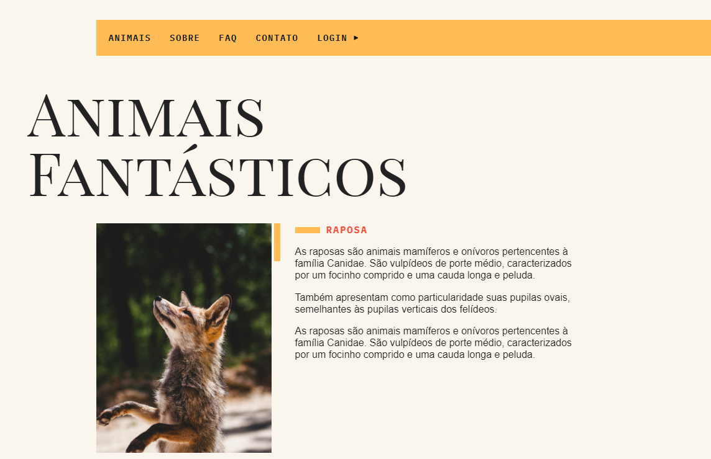

# Animais Fantásticos

> Projeto desenvolvido no curso de Javascript da Origamid.
> <a href="https://juliocesarj.github.io/Animais-Fantasticos/">Clique aqui para visualizar o projeto</a>

## 💻 Pré-requisitos

Antes de começar, verifique se você atendeu aos seguintes requisitos:

* Navegador de Internet (Chrome, Edge, Safari e etc)

## ☕ Usando Animais Fantásticos

Para executar o projeto é preciso abrir o arquivo index.html ou dentro do vscode executar a extensão live server.

Adicione comandos de execução e exemplos que você acha que os usuários acharão úteis. Fornece uma referência de opções para pontos de bônus!

## 📫 Contribuindo para Animais Fantásticos

Para contribuir com Animais Fantásticos, siga estas etapas:

1. Bifurque este repositório.
2. Crie um branch: `git checkout -b <nome_branch>`.
3. Faça suas alterações e confirme-as: `git commit -m '<mensagem_commit>'`
4. Envie para o branch original: `git push origin <nome_do_projeto> / <local>`
5. Crie a solicitação de pull.

Como alternativa, consulte a documentação do GitHub em [como criar uma solicitação pull](https://help.github.com/en/github/collaborating-with-issues-and-pull-requests/creating-a-pull-request).

## 😄 Seja um dos contribuidores

Quer fazer parte desse projeto? Clique [AQUI](CONTRIBUTING.md) e leia como contribuir.

## 📝 Licença

Esse projeto está sob licença. Veja o arquivo [LICENÇA](LICENSE.md) para mais detalhes.
